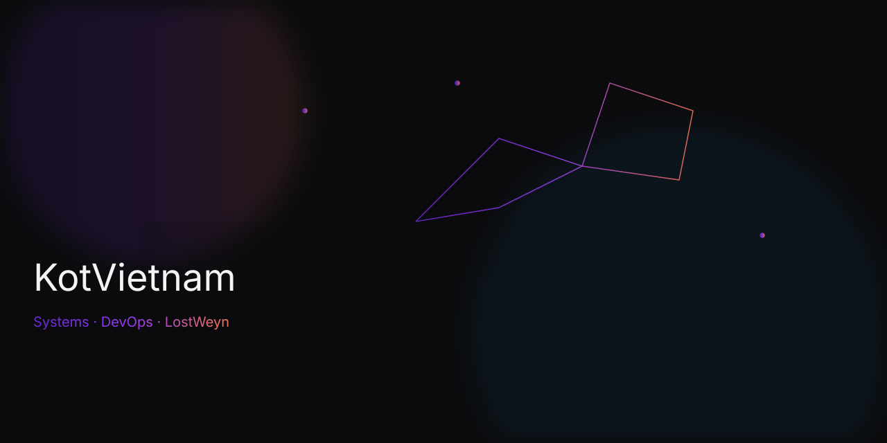

<!-- updated: AUTO -->
<h1 align="center">
  
  ACCESS GRANTED: Welcome to <a href="https://lostweyn.aspc.kz" target="_blank">KotVietnam Mainframe</a>
</h1>
<h3 align="center">🧠 System Administrator | 🧰 DevOps Engineer | ⚡ Cluster Architect</h3>

<p align="center">
  
</p>

---

### 🧩 Terminal Info

```bash
whoami
user: KotVietnam
location: Almaty, Kazakhstan
mission: Automate. Or die trying.
status: Online ✅
```

---

### ⚙️ Core Stack
<p align="center">
  
</p>

---

### 💾 System Metrics
<p align="center">
  
  
</p>

---

### 🧠 Neural Activity
<p align="center">
  
</p>

<p align="center">
  
</p>

---

### 🧮 Analytics Grid
<p align="center">
  
</p>

---

### 📰 Feed: Habr Blog Posts
<!-- BLOG-POST-LIST:START -->
<!-- BLOG-POST-LIST:END -->

---

### 🎭 Randomized Console Output
<p align="center">
  
</p>

<p align="center">
  
</p>

---

### ⚡ Uptime Monitor
<p align="center">
  
  
</p>

---

### 🧮 System Process

```bash
> systemctl status KotVietnam.service
Loaded: active (running)
Main PID: 404 (ai-core)
Tasks: 42 (infinity)
Memory: 64GB distributed
CPU: Ryzen 7 5700X
CGroup: /system.slice/kotvietnam.service
└─ Running processes: [DevOps, Automation, AI, ClusterOps]

```
---

<p align="center">
  
</p>

<h3 align="center">💀 LostWeyn Division // "Automate everything. Leave nothing manual."</h3>
